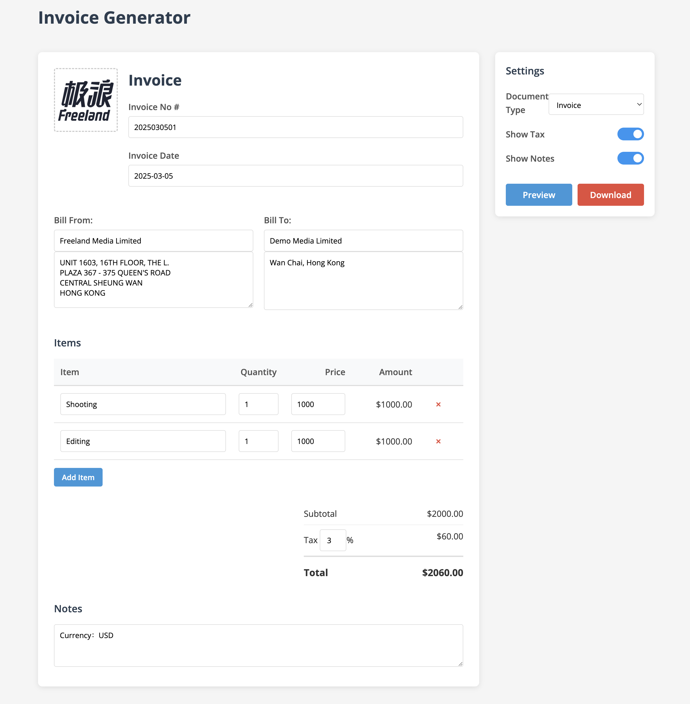
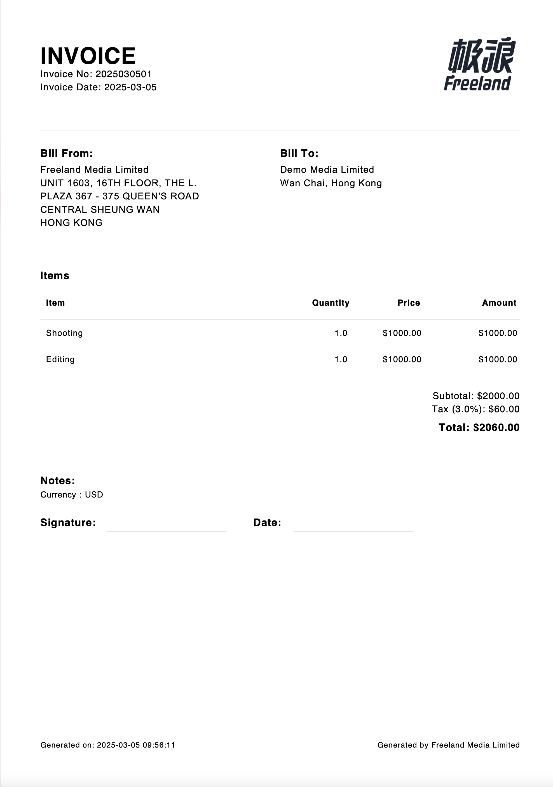

 # 发票生成器 (Invoice Generator)

一个简单而强大的网页应用，用于创建和生成PDF格式的专业发票。支持中英文混排，适合个人创业者和小型企业使用。

## 功能特点

- 🧾 创建专业的PDF格式发票
- 🖼️ 支持上传公司logo，增强品牌形象
- 📝 添加多个商品/服务项目，自动计算金额
- 🧮 自动计算小计、税费和总计
- 🌐 支持中英文混排，满足国际化需求
- 📱 响应式设计，适配不同设备
- 💾 预览和下载功能，方便使用
- 🔄 简单直观的用户界面，无需培训即可上手

## 安装指南

### 前提条件

- Python 3.8+
- pip (Python包管理器)

### 安装步骤

1. 克隆此仓库到本地
   ```bash
   git clone https://github.com/yourusername/freeland-invoice-generator.git
   cd freeland-invoice-generator
   ```

2. 创建并激活虚拟环境（推荐）
   ```bash
   # 使用conda
   conda create -n invoice-env python=3.8
   conda activate invoice-env
   
   # 或使用venv
   python -m venv invoice-env
   source invoice-env/bin/activate  # Linux/Mac
   # invoice-env\Scripts\activate  # Windows
   ```

3. 安装依赖
   ```bash
   pip install -r requirements.txt
   ```

4. 运行应用
   ```bash
   # 使用脚本运行（推荐）
   chmod +x run.sh  # 确保脚本有执行权限
   ./run.sh
   
   # 或直接运行
   python app.py
   ```

5. 在浏览器中访问 `http://localhost:5002`

## 使用指南

### 基本使用流程

1. **填写发票基本信息**
   - 发票编号
   - 发票日期
   - 发票到期日
   - 公司信息（发票出具方）
   - 客户信息（发票接收方）

2. **添加商品/服务项目**
   - 点击"添加项目"按钮添加多个商品或服务
   - 为每个项目填写描述、数量、单价
   - 系统会自动计算每个项目的金额

3. **设置税率（可选）**
   - 如需添加税费，可设置税率百分比
   - 系统会自动计算税额

4. **添加备注（可选）**
   - 可添加付款条件、付款方式等信息

5. **预览和下载**
   - 点击"预览"按钮查看发票效果
   - 点击"下载"按钮获取PDF文件

### 自定义选项

- **上传公司logo**：点击logo区域上传您的公司标志
- **货币选择**：可选择不同货币符号
- **日期格式**：支持多种日期格式


## 截图



```

## 技术栈

- **后端**：
  - Python 3.8+
  - Flask 2.3.3 (Web框架)
  - ReportLab 4.0.4 (PDF生成)
  - Pillow 10.0.0 (图像处理)

- **前端**：
  - HTML5
  - CSS3
  - JavaScript (原生)
  - 响应式设计

## 贡献指南

欢迎贡献代码、报告问题或提出新功能建议！

1. Fork 这个仓库
2. 创建您的特性分支 (`git checkout -b feature/amazing-feature`)
3. 提交您的更改 (`git commit -m 'Add some amazing feature'`)
4. 推送到分支 (`git push origin feature/amazing-feature`)
5. 创建一个 Pull Request

## 许可证

本项目采用 MIT 许可证 - 详情请参阅 [LICENSE](LICENSE) 文件


---

**注意**：此发票生成器仅用于创建发票模板，请根据您所在国家/地区的法律法规使用。